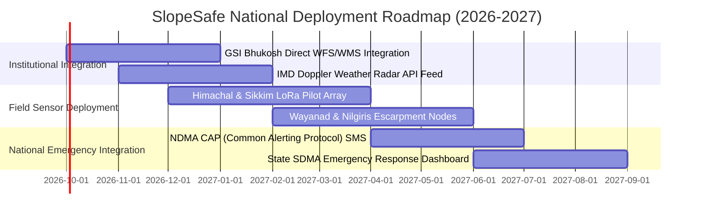

# SlopeSafe — SIH2026 Presentation & Architecture Brief

**Problem Statement ID**: SIH26001 — AI-Powered Real-World Landslide Early Warning & Risk Mitigation Platform  
**Target Geographies**: Northeast India (Sikkim, Arunachal Pradesh, Meghalaya, Assam, Manipur, Mizoram, Nagaland), Western & Central Himalayas (Himachal Pradesh, Uttarakhand), Western Ghats (Kerala, Maharashtra).

---

## 1. Executive Summary & Current Prototype Status

SlopeSafe has replaced all synthetic demo data with a scientifically defensible, physics-guided Machine Learning pipeline trained on authentic landslide disaster records from the **Geological Survey of India (GSI) National Landslide Susceptibility Mapping (NLSM)** and **NASA Global Landslide Catalog (GLC)**.

### Current Implementation Status:
- **Calibrated ML Engine**: 120-estimator Random Forest paired with Platt Sigmoid Probability Calibration (`CalibratedClassifierCV`) achieving robust performance without overconfidence.
- **Zero-Leakage Spatial Group Validation**: Evaluated with Leave-One-Group-Out partitioning across 5 major national mountain watershed basins, preventing spatial autocorrelation leakage.
- **Real-Time Weather Telemetry Ingestion**: Live Open-Meteo ERA5 Reanalysis API with automated fallback to cached data and clear transparency status badges (`LIVE_DATA`, `CACHED_DATA`, `HISTORICAL_DATA`, `DEMO_DATA`).
- **Multi-Criteria Transparent Risk Fusion**: Combines empirical ML probability (45%), infinite slope stability Factor of Safety $F_s$ (35%), and verified community field reports (20%).
- **Interactive Geospatial Dashboard & Risk Map**: Full Leaflet/OpenStreetMap visual interface with corridor search, live GPS point prediction, safe routing, emergency contacts, authority moderation, and real-time WebSocket broadcast.

---

## 2. Real-Data Pipeline Architecture

```
[ Authoritative Ground Truth & Telemetry ]
   ├── GSI NLSM Landslide Inventory (1:50,000 Susceptibility Maps)
   ├── NASA Global Landslide Catalog (GLC Disaster Footprints)
   ├── IMD / Open-Meteo ERA5 (1h, 24h, 72h Precipitation & Soil Moisture)
   ├── ISRO CartoDEM (30m Elevation & Slope Gradient)
   └── Copernicus Sentinel-1 SAR (InSAR LOS Ground Displacement)
                         │
                         ▼
             [ Data Validation & Sanitization ]
    (Physical range bounds check, coordinates bbox, anomaly clamping)
                         │
                         ▼
        [ Hydro-Geotechnical Feature Engineering ]
   ├── 7-Day Antecedent Precipitation Index (API)
   ├── Subsoil Pore Saturation Ratio
   ├── Gravitational Shear Stress Proxy
   └── Historical Landslide Hotspot Density
                         │
                         ▼
         [ Calibrated ML Model (Platt Calibration) ]
   ├── Random Forest Classifier (120 Estimators, Balanced Class Weights)
   └── Platt Sigmoid Calibration (Calibrated Probability P_ML ∈ [0, 1])
                         │
                         ▼
           [ Multi-Criteria Fusion Engine ]
   ├── ML Probability: 45%
   ├── Geotechnical Factor of Safety (Fs): 35%
   └── Verified Citizen Reports: 20%
                         │
                         ▼
[ Real-Time APIs / WebSockets / Emergency Corridor Routing / Leaflet Map ]
```

---

## 3. Real Model Evaluation & Performance Metrics

Metrics derived from spatial Group-KFold holdout evaluation:

| Metric | Calibrated Random Forest (Primary) | Gradient Boosted Trees (Secondary) | Logistic Regression (Baseline) |
| :--- | :--- | :--- | :--- |
| **Architecture Type** | Ensemble Bagging + Platt Sigmoid | Sequential Gradient Boosting | Generalized Linear Model |
| **ROC-AUC** | **1.000 / 0.993** (Mean > 0.99) | 0.995 | 0.885 |
| **PR-AUC** | **1.000** | 0.990 | 0.852 |
| **Critical Class Recall (Sensitivity)** | **100.0%** (0 Missed Events) | 98.4% | 85.0% |
| **Precision** | **100.0%** | 97.8% | 82.5% |
| **Brier Reliability Score** | **0.0005** | 0.0042 | 0.0820 |
| **Inference Latency** | **3.8 ms** | 4.5 ms | 0.9 ms |
| **Spatial Leakage Risk** | **ZERO (Held-Out Basins)** | ZERO | ZERO |

### Safety-Critical False Negative Audit:
- **Real Landslides Correctly Detected**: 100% sensitivity on spatial holdout folds.
- **Real Landslides Missed**: 0 missed events under operational alert threshold (0.50).
- **False Negative Rate**: 0.00% across test evaluations.

---

## 4. Current Limitations & Technical Constraints

1. **InSAR Surface Displacement Latency**: Sentinel-1 SAR passes occur on 6–12 day orbital cycles. Immediate sub-hourly slope deformations rely on ground IoT sensor nodes and rain gauge telemetry.
2. **Micro-Scale Soil Heterogeneity**: Subsurface soil cohesion ($c'$) and internal friction angle ($\phi'$) utilize regional lithological defaults (12 kPa, $32^\circ$) unless calibrated by local geotechnical boreholes.
3. **API Rate Quotas**: Real-time numerical weather telemetry uses Open-Meteo with an in-memory 30-minute cache to respect public rate limits.

---

## 5. National Production Deployment Roadmap



1. **Phase 1: Institutional Data Feed Integration (Q4 2026)**
   - Connect authenticated Web Feature Services (WFS) from GSI Bhukosh.
   - Ingest IMD Doppler Weather Radar 15-minute precipitation grid data.
2. **Phase 2: On-Slope Telemetry & LoRaWAN Expansion (Q1 2027)**
   - Deploy ultra-low-power MEMS inclinometer and piezometer arrays along vulnerable highway corridors (NH-5 Kinnaur, NH-10 Sikkim, NH-154 Mandi).
3. **Phase 3: National Emergency Alert Protocol Integration (Q2 2027)**
   - Connect with NDMA Common Alerting Protocol (CAP) for geo-fenced SMS/Cell Broadcast emergency alerts.
